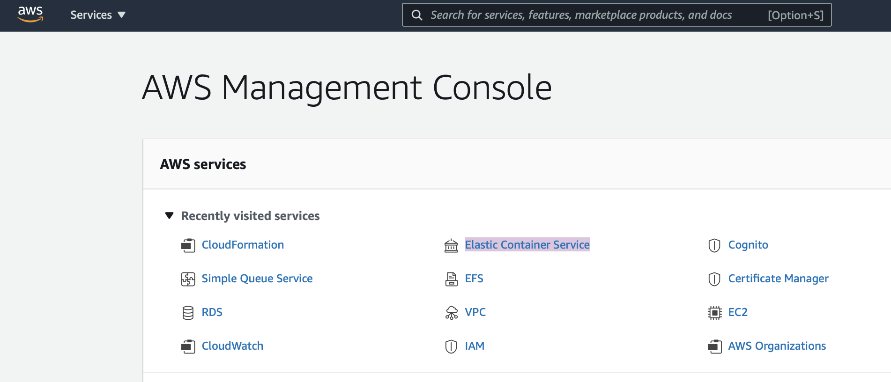
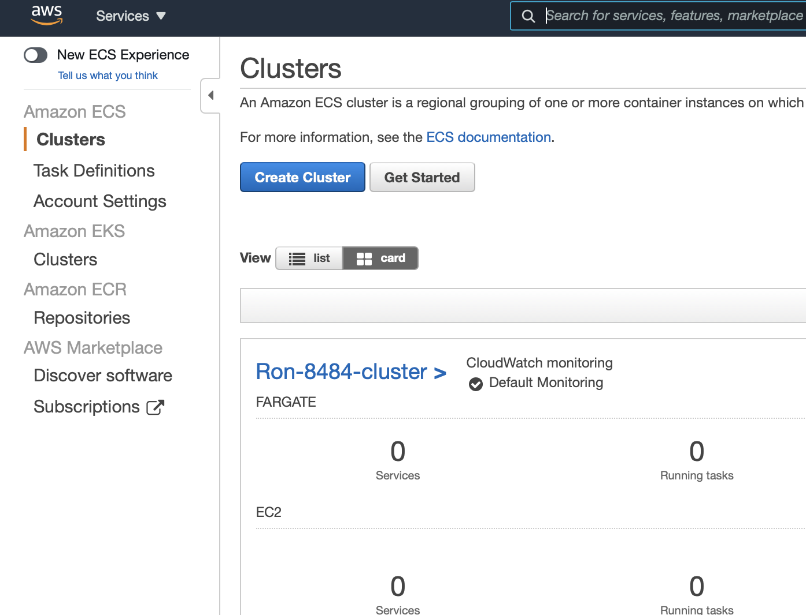
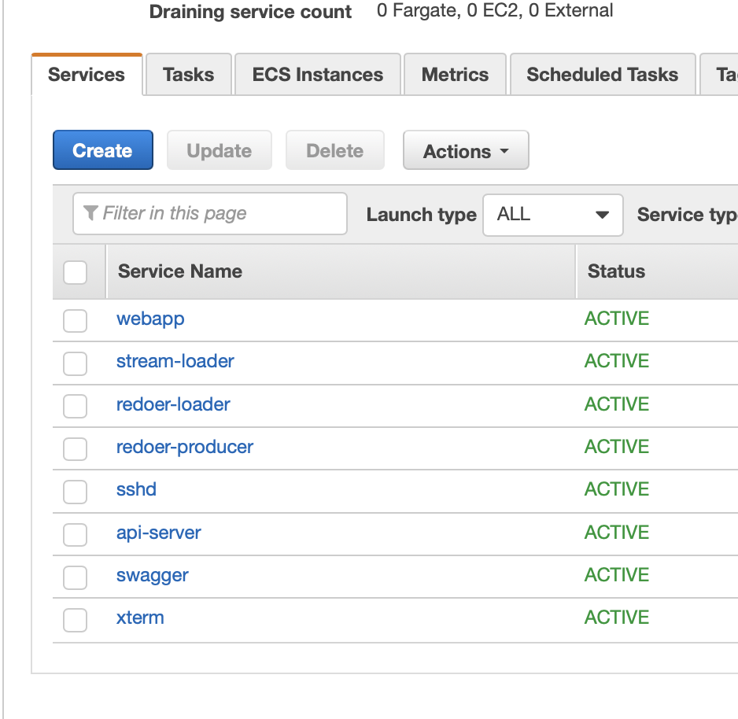
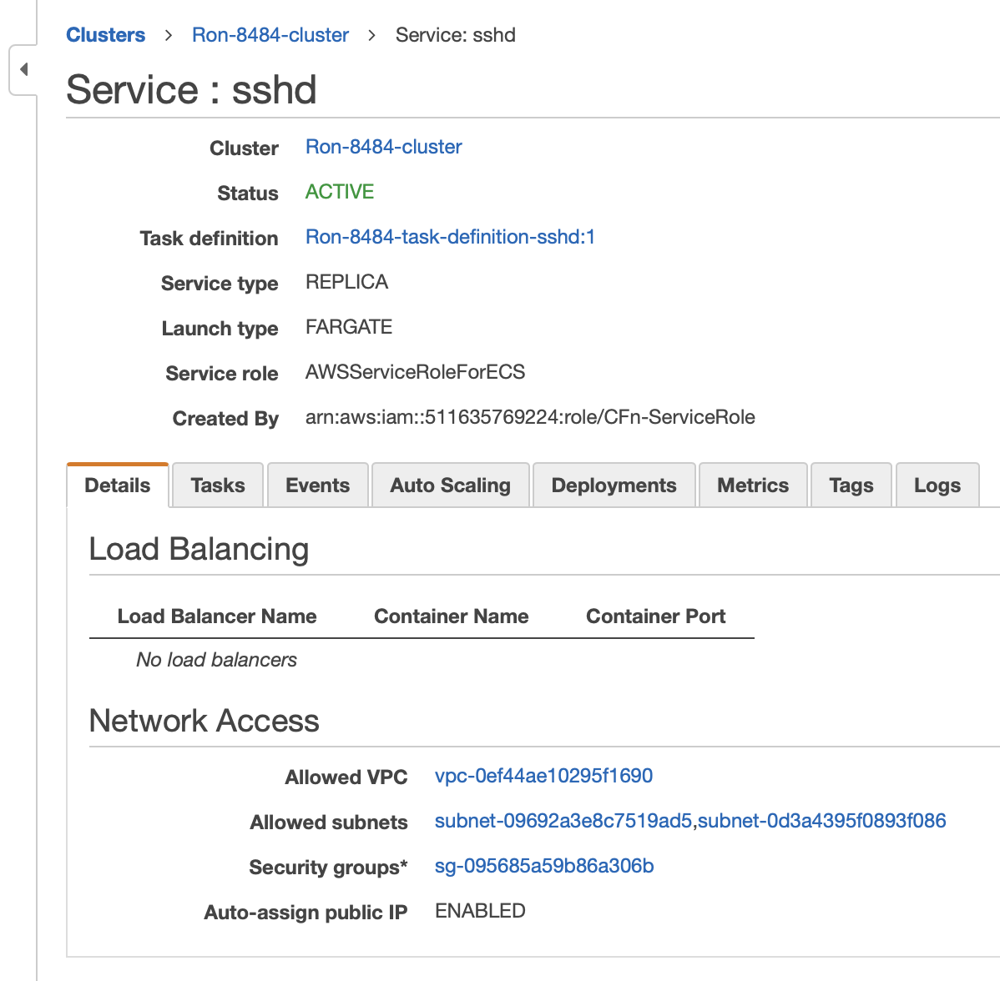
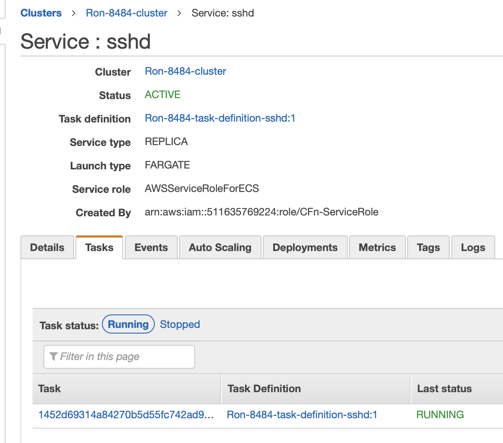
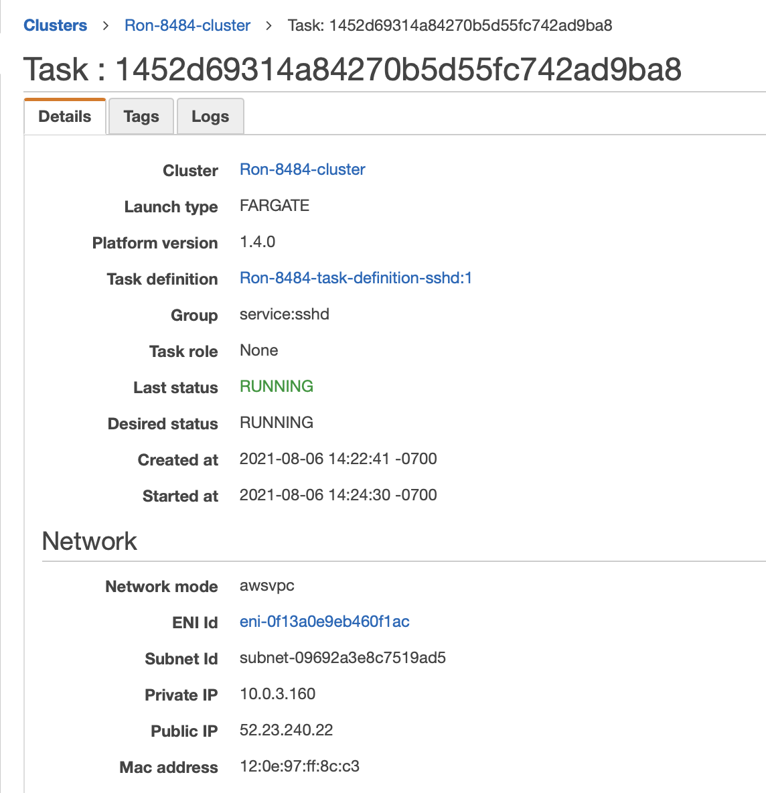

# How to find the SSHD container's public ip address in AWS

## Open ECS

From the AWS management console search for "ECS" in the search box at the top of the page.

## Select the Cluster

Select the appropriate cluster in the list of clusters by click it's name.

## Selected the 'sshd' service

From the list of services, click the sshd service name.

## Select the tasks tab

On the sshd service page select the tasks tab

## Select the task id

On the tasks tab click the task id link, left hand column.

## Find the public ip

On the task page, the public IP can be found in the network section

