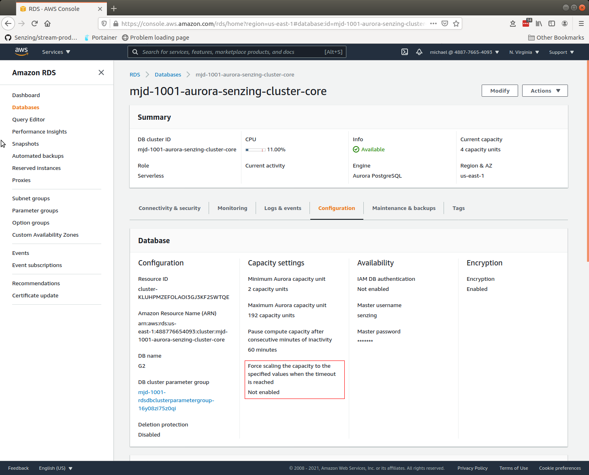
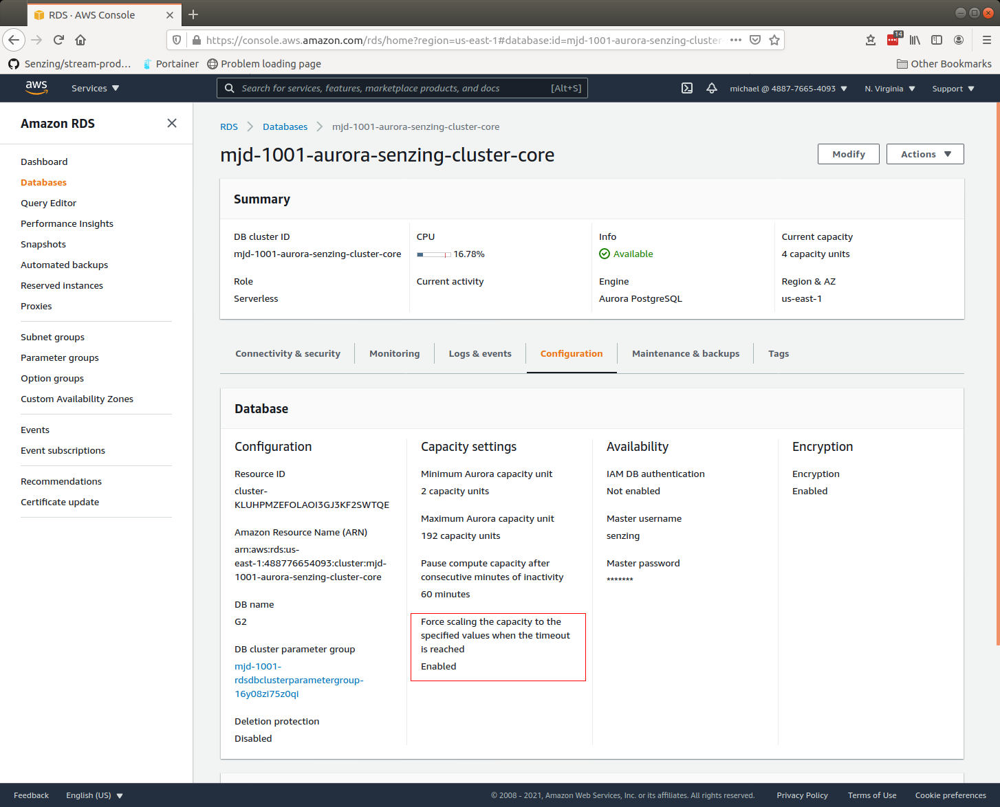

# How to set AWS RDS force-scaling-capacity

## The issue

When AWS RDS Aurora Postgres Serverless needs to scale up, it needs a scaling point.
If it can't find one, the `TimeoutAction` value affects how scaling is performed when a scaling point can't be found.
For the Senzing Cloudformation stack, the value of `TimeoutAction` needs to be set to `ForceApplyCapacityChange`.
For more information on this, see AWS
[Timeout action for capacity changes](https://docs.aws.amazon.com/AmazonRDS/latest/AuroraUserGuide/aurora-serverless.how-it-works.html#aurora-serverless.how-it-works.timeout-action).

In an AWS Cloudformation template, the specification for `TimeoutAction` is not supported.
This defect has been reported to AWS:

1. [AWS cloudformation roadmap - issue #298](https://github.com/aws-cloudformation/aws-cloudformation-coverage-roadmap/issues/298)

However, AWS doesn't seem to be taking the issue seriously.

For reference, Senzing has documented it in their Senzing Cloudformation templates.
Example:
[cloudformation.yaml](https://github.com/Senzing/aws-cloudformation-ecs-poc-simple/blob/7061f269d8658b5234e012bb6d8e12f24fc3ab7c/cloudformation.yaml#L1565-L1568)

### The request

1. Visit [GitHub issue #298](https://github.com/aws-cloudformation/aws-cloudformation-coverage-roadmap/issues/298).
   Let `@michaelwittig` know that this needs to be fixed.
   Also add your thumbs up,
   because apparently the folks at AWS Cloudformation don't realize how important it is that the
   Cloudformation engine implement the spec for each resource.
   (Yes, that is sarcasm.)

### The fix

1. Visit [AWS Amazon RDS console](https://console.aws.amazon.com/rds/home).
1. In left-hand navigation bar, choose "Databases".
1. In the "DB identifier" column, choose the database.
1. Choose the "Configuration" tab.
1. You'll probably see something like the following highlighted in a red outline:
   
1. In the upper-right, click the "Modify" button.
1. In "Modify DB cluster: [cluster-name]", "Capacity settings", expand "Additional scaling configuration".
    1. Check ":ballot_box_with_check: Force scaling the capacity to the specified values when the timeout is reached"
    1. At bottom-right, click "Continue" button.
1. Review "Summary of modifications" and "Scheduling of modifications".
    1. Make any changes necessary.
    1. In bottom-right, click "Modify cluster" button.
1. When successful, the configuration will look like this:
   
