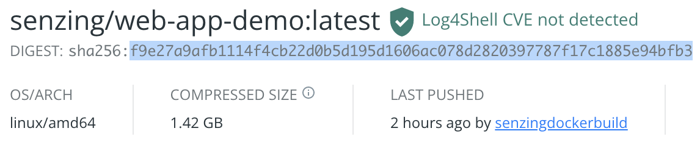
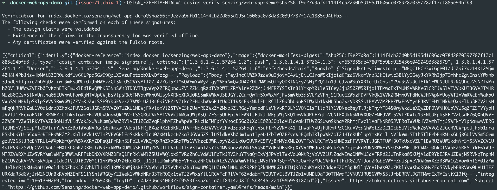

# How to verify container

## Container Signature Verification

Container image integrity has become increasingly important as images are being deployed into zero-trust environments. The image integrity is achieved by container signatures. They provide developers with cryptographic assurance that the images they are pulling in are from a trusted source.

To verify Senzing's dockerhub images, first copy the hash of the docker image pulled.


Then verify the hash using cosign.

```console
COSIGN_EXPERIMENTAL=1 cosign verify senzing/web-app-demo@sha256:<insert sha256 hash>
```

This is what a successful verification looks like.


To learn more about cosign and how to install, go [here](https://github.com/sigstore/cosign).
