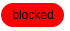
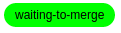
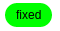
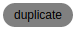
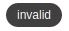
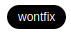

# GitHub labels

## Process states

| Category   | Labels |
|------------|--------|
| Problems   |  |
| Pending    |  |
| Done       | |
| Inactive   |    |

## Non-process

| Category   | Labels |
|------------|--------|
| Issue type |        |

## Values

| Text             |                                                                   | Color   | Description                               |
|------------------|-------------------------------------------------------------------|---------|-------------------------------------------|
| blocked          |  | #FF0000 | Cannot make progress                      |
| duplicate        |  | #999999 | This issue or pull request already exists |
| fixed            |  | #00FF00 | Fixed. Waiting for issue creator to close |
| invalid          |  | #666666 | This doesn't seem right                   |
| waiting-to-merge |  | #FF9900 | Code complete, cannot merge yet           |
| wontfix          |  | #000000 | This will not be worked on                |

## References

1. [How we organize GitHub issues: A simple styleguide for tagging](https://robinpowered.com/blog/best-practice-system-for-organizing-and-tagging-github-issues/)
1. [Web safe color chart](https://htmlcolorcodes.com/color-chart/web-safe-color-chart/)
1. [Senzing repository labels](https://github.com/organizations/Senzing/settings/labels) - may only be available to account admins
1. Legacy tags:
   1. accepted
   1. bug
   1. conversation
   1. dependencies
   1. documentation
   1. duplicate
   1. enhancement
   1. fixed
   1. invalid
   1. open
   1. performance
   1. question
   1. refactoring
   1. testing
   1. wontfix
