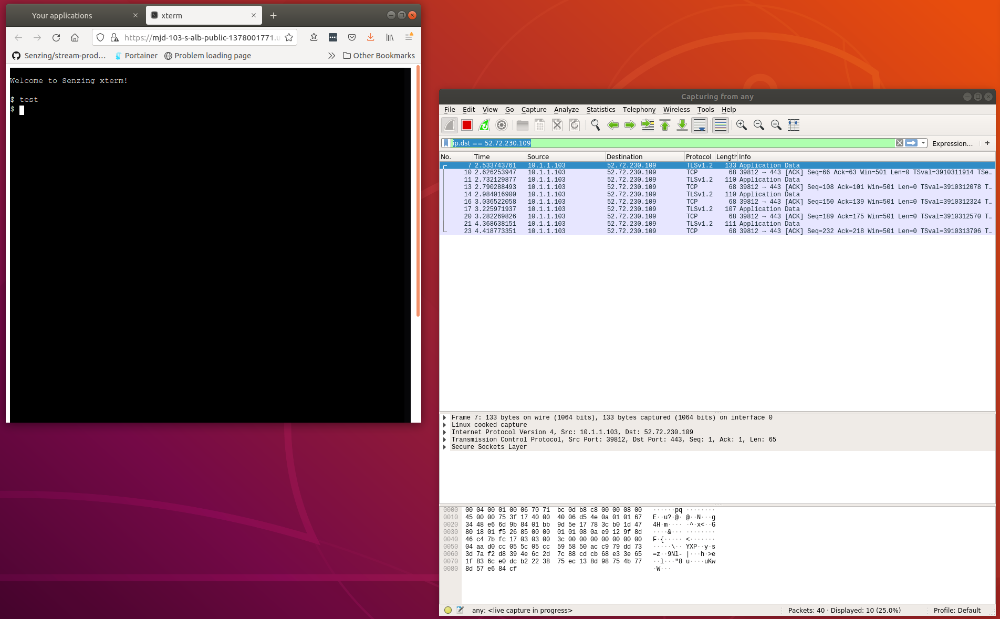
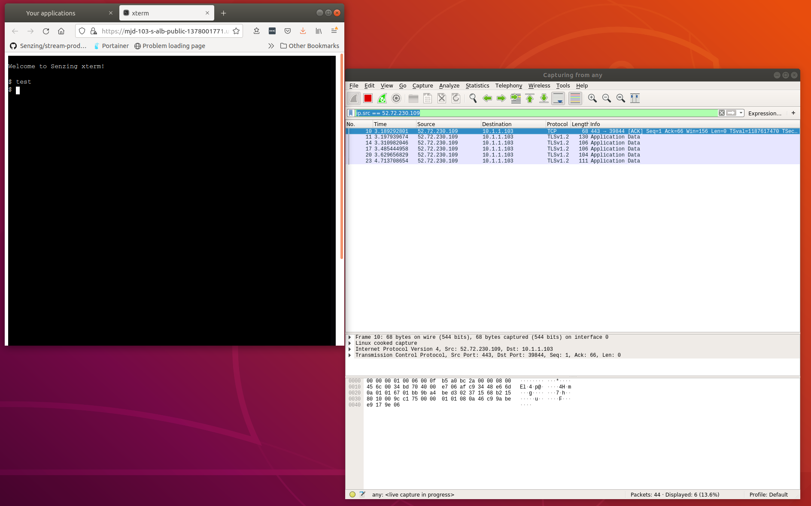
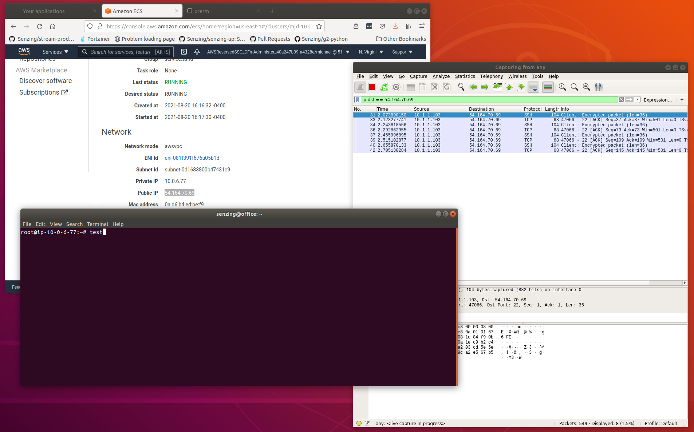

# XTerm security

## XTerm vs. SSHD container

| Feature            | XTerm      | SSHD       | Notes                                  |
|--------------------|------------|------------| ---------------------------------------|
| Inbound CIDR       | Yes        | Yes        | Configured by cloudformation template. |
| AWS Cognito        | Yes        | No         | |
| - Unique users     | Yes        | No         | |
| - Unique passwords | Yes        | No         | |
| - Revoke users     | Yes        | No         | |
| - MFA support      | Yes        | No         | |
| Network transport  | TLSv1.2    | SSH        | |
| Runs as            | 1001       | root       | Configured by cloudformation template. |
| sudo command       | No         | Yes        | |
| /opt/senzing       | read-only  | read-write | Configured by cloudformation template. |
| /etc/opt/senzing   | read-only  | read-write | Configured by cloudformation template. |
| /var/opt/senzing   | read-write | read-write | Configured by cloudformation template. |

## Details

### Network traffic for socketio

Using
[wireshark](https://www.wireshark.org/)
it is seen that the network traffic for XTerm is protected by TLSv1.2
and network traffic for SSH is protected by SSH

#### XTerm to host traffic

In the image, five keys were hit `test<return`.
Five packets were sent to the host, all using TLSv1.2
When inspecting the packets, the keystrokes were not seen in cleartext.

#### Host to XTerm traffic

Filtering Wireshark with `ip.src == 52.72.230.109` to see the traffic coming back from the `52.72.230.109` host,
all five packets returned are transported using TLSv1.2.

#### SSH traffic

In a test of `ssh`-ing into the `senzing/sshd` docker container,
all of the 5 keystrokes were sent via the "SSH" protocol.

